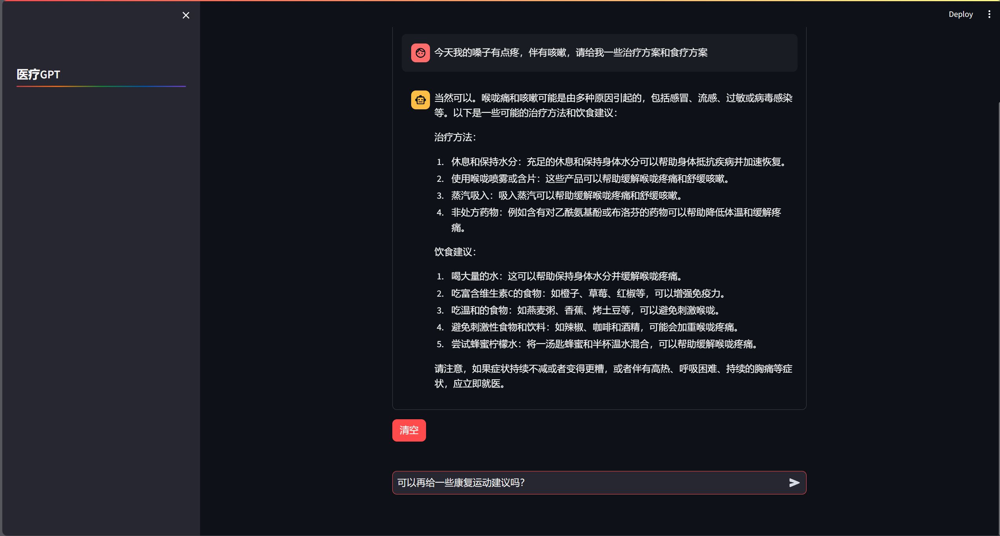
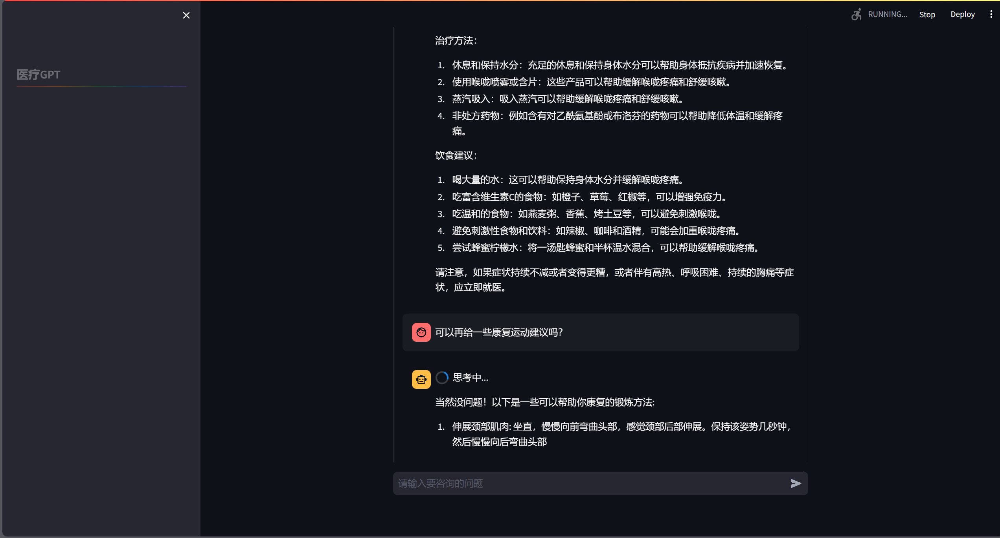

# MedicalChatGPT
一个基于大模型微调的中文医疗问答机器人应用

## 安装运行环境
pip install -r requirements.txt

## 下载预训练模型：
| Model          | Backbone           | Checkpoint    |
| -------------- | ------------------ | ------------- |
| HuatuoGPT2-7B  | Baichuan2-7B-Base  | [HF Lnik](https://huggingface.co/FreedomIntelligence/HuatuoGPT2-7B) |
| HuatuoGPT2-13B | Baichuan2-13B-Base | [HF Lnik](https://huggingface.co/FreedomIntelligence/HuatuoGPT2-13B) |
| HuatuoGPT2-34B | Yi-34B             | [HF Lnik](https://huggingface.co/FreedomIntelligence/HuatuoGPT2-34B) |

## 运行
- 下载模型后，将config.py里的model_path更改为模型路径
- 控制台交互：python gpt_cli.py
- 可视化网页界面交互：streamlit run chat_app.py

## 应用运行示例

  

  

## 感谢该项目及其人员提供的帮助：
[**HuatuoGPT-II**](https://github.com/FreedomIntelligence/HuatuoGPT-II): An Domain-enhanced Medical Large Language Model